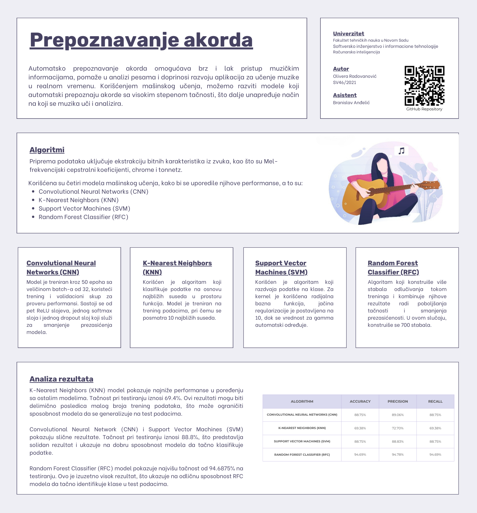

# Chord Recognition README

 

## Problem Definition
The objective of this project was to develop a model capable of analyzing audio recordings and recognizing the chords played. Musicians, music teachers, and music enthusiasts often desire to identify the chords played in songs for learning or playing purposes. Manual chord recognition can be slow and requires a certain level of musical knowledge, posing challenges for beginners and amateur musicians.

## Motivation
Automatic chord recognition is essential as it facilitates easier and faster access to musical information. This can greatly benefit musicians, teachers, and students in quickly analyzing songs, thereby streamlining the learning and music creation processes. Moreover, music enthusiasts can learn to play songs more easily, fostering increased interest in musical creativity.

Additionally, the technology explored in this project lays the foundation for the development of mobile applications capable of real-time song analysis and automatic chord display. Such applications would enable musicians to effortlessly follow chords while listening to music, making the learning and performance of songs much more accessible. Furthermore, music teachers could leverage these applications as educational tools, while composers could draw inspiration for new musical compositions.

## Dataset
The datasets utilized for this project were sourced from the Kaggle platform, specifically the [Guitar Chords Dataset v3](https://www.kaggle.com/mattcarter865/guitar-chords-dataset-v3). This dataset comprises 8 chords (Am, Bb, Bdim, C, Dm, Em, F, G) played on various guitars and in 4 different ways. It was divided into training (1440 .wav files) and test (320 .wav files) sets.

## Data Preprocessing
Data preprocessing involved normalization to ensure consistency during model training. Feature extraction was carried out using the librosa library, generating the following features:
- Mel-frequency cepstral coefficients (MFCC) focusing on timbral characteristics.
- Chroma focusing on tonal information in the audio signal.
- Tonnetz focusing on harmonic and tonal relationships between notes and chords.

## Methodology
The initial steps included data normalization and feature extraction from the audio recordings. To address the problem, four distinct models were employed to compare their performance and determine the most effective approach. The models utilized were:
- Convolutional Neural Networks (CNN)
- K-Nearest Neighbors (KNN)
- Support Vector Machines (SVM)
- Random Forest Classifier (RFC)

## Sample Output
The models were trained on the same training set, followed by performance evaluation on the test set. Finally, the results obtained using different models were described and compared.

## Evaluation Method
The dataset was divided into training and test sets, with 20% of the training set allocated for validation (specifically for Convolutional Neural Networks). Evaluation metrics employed included:
- Accuracy: the percentage of correctly predicted results relative to the total number of test instances.
- Precision: the accuracy with which the model classifies predictions marked as positive.
- Recall: the accuracy with which the model classifies predictions that are actually positive.

## Technologies
The project was implemented using the following technologies:
- Programming Language: Python
- Libraries: librosa, scikit-learn, tensorflow, numpy, and os
